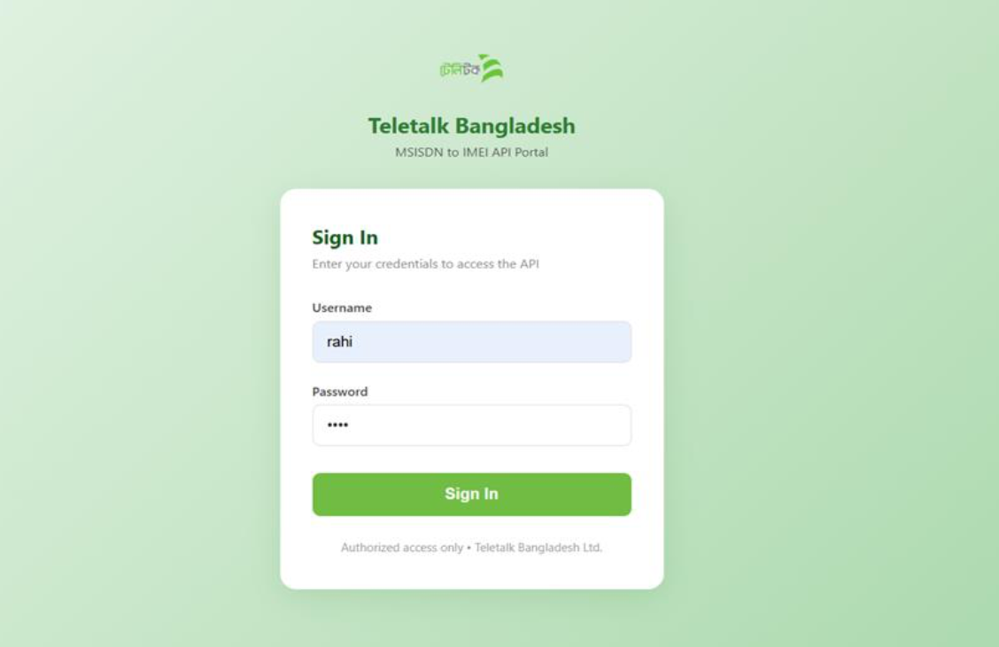
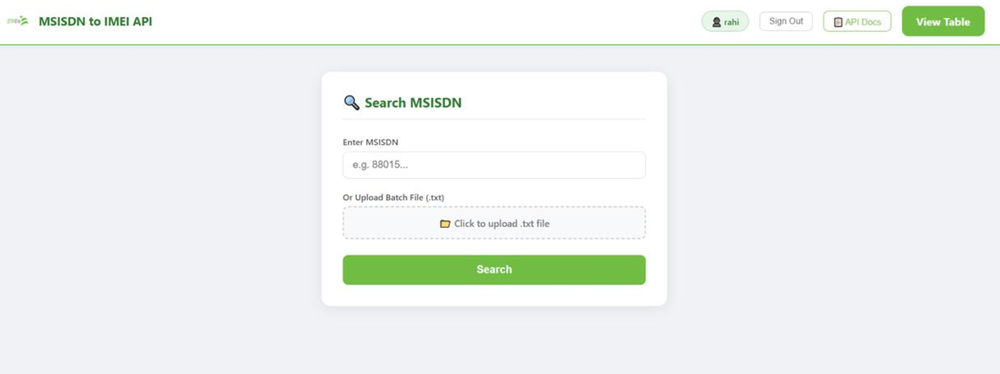
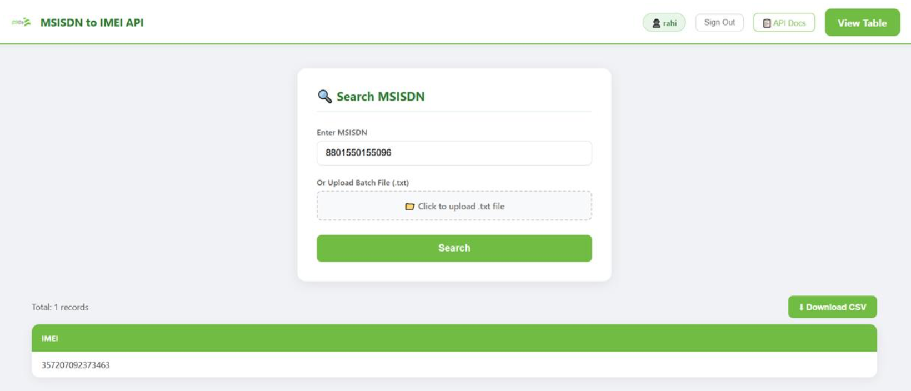
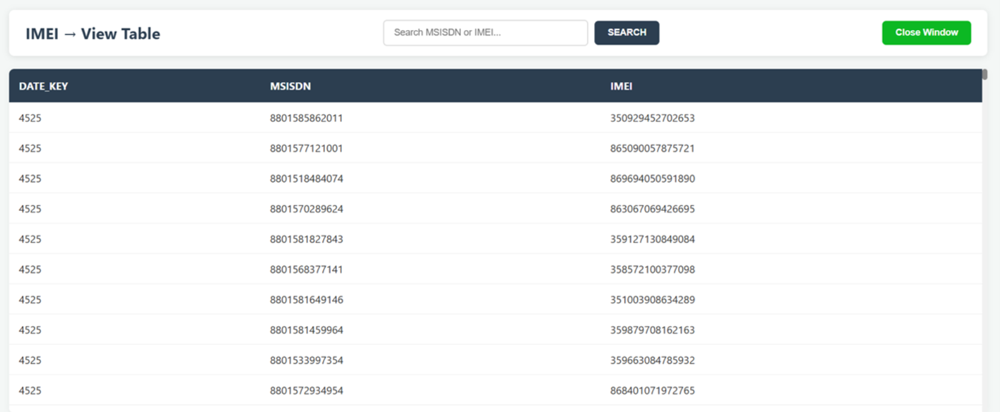
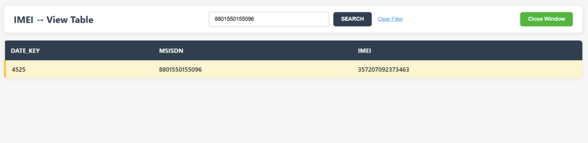
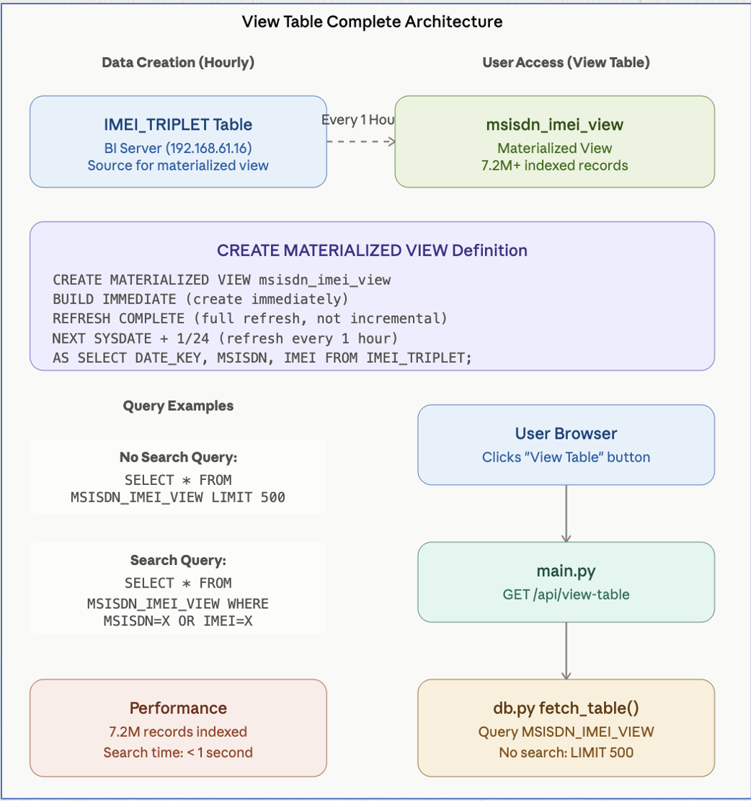
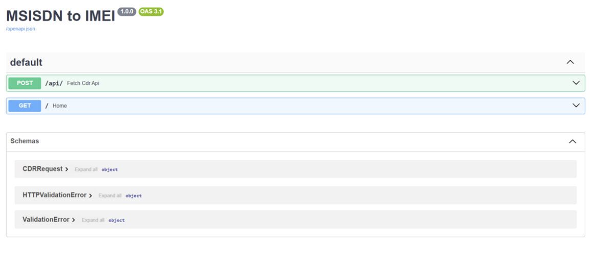
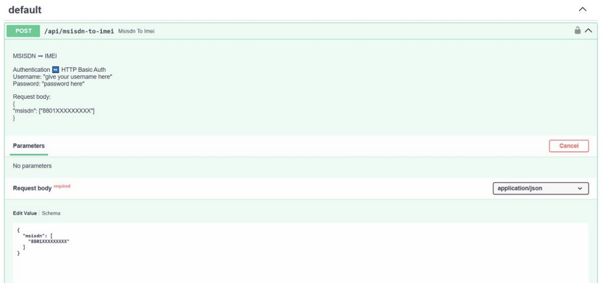

# MSISDN to IMEI API

[]()
[]()
[]()
[]()

**MSISDN to IMEI Conversion API** - A high-performance, secure REST API for converting Mobile Subscriber ISDN (MSISDN) numbers to International Mobile Equipment Identity (IMEI) values from Teletalk Bangladesh Limited's Data Warehouse.

---

## 🎯 Overview

The MSISDN to IMEI API provides authorized third-party access to Teletalk's comprehensive mobile device mapping database. This service enables real-time conversion of mobile subscriber numbers (MSISDN) to their corresponding device identifiers (IMEI), supporting both programmatic access via REST API and interactive browsing via web dashboard.

**Organization:** Teletalk Bangladesh Limited  
**Project Type:** Internal FAST API (REST)  
**Environment:** Production  
**Base URL:** `http://192.168.61.254:9000`  
**Documentation:** [API Docs](http://192.168.61.254:9000/docs)

---

## ✨ Features

### Core Capabilities

- **HTTP REST API** - Programmatic MSISDN to IMEI conversion
- **Batch Processing** - Convert up to 50 MSISDN numbers per request
- **HTTP Basic Authentication** - Secure credential-based access control
- **Real-time Data** - Direct access to Data Warehouse via materialized views
- **JSON Response** - Structured, easy-to-parse response format
- **Audit Logging** - Complete request tracking by username

### Additional Features

- **Interactive Dashboard** - Web-based query interface
- **View Table** - Browse 7.2 million+ records with search
- **Batch Upload** - Upload .txt files with multiple MSISDN numbers
- **CSV Export** - Download results in CSV format
- **Swagger Documentation** - Interactive API testing interface
- **User Management** - Create, deactivate, and manage user accounts


---

## ⚙️ Configuration

### Environment Variables (.env)

```env
# Server Configuration
HOST=0.0.0.0
PORT=8000
WORKERS=1
LOG_LEVEL=INFO
DEBUG=False

# Database Configuration - Primary DWH
DB_PRIMARY_HOST=192.168.61.204
DB_PRIMARY_PORT=1521
DB_PRIMARY_NAME=dwhdb03
DB_PRIMARY_USER=dwh_user03
DB_PRIMARY_PASSWORD=your_password_here

# Database Configuration - BI Server
DB_BI_HOST=192.168.61.16
DB_BI_PORT=1521
DB_BI_NAME=datadb01
DB_BI_USER=dwh_user
DB_BI_PASSWORD=your_password_here

# Application Settings
SECRET_KEY=your_secret_key_here
SESSION_TIMEOUT=3600
MAX_BATCH_SIZE=50
QUERY_TIMEOUT=60
```

### Oracle Connection String

```
Primary DWH:   192.168.61.204:1521/dwhdb03
BI Server:     192.168.61.16:1521/datadb01
```

### User Management

```bash
# Add new user
python manage_users.py add username password

# List all users
python manage_users.py list

# Deactivate user
python manage_users.py deactivate username

# Delete user
python manage_users.py delete username
```

---

## 📖 Usage

### REST API

#### Endpoint: POST /api/msisdn-to-imei

Convert MSISDN numbers to IMEI values.

**Request:**
```bash
curl -X POST http://192.168.61.254:9000/api/msisdn-to-imei \
  -H "Content-Type: application/json" \
  -u username:password \
  -d '{
    "msisdn": ["88015XXXXXXXX"]
  }'
```

**Response (HTTP 200):**
```json
{
  "status": "success",
  "requested_by": "username",
  "count": 1,
  "data": [
    {
      "IMEI": "35XXXXXXXXXXXXX"
    }
  ]
}
```

**Parameters:**

| Parameter | Type | Required | Description |
|-----------|------|----------|-------------|
| msisdn | Array[String] | Yes | MSISDN numbers (Format: 88015XXXXXXXX) |
| start_date | String | No | Start date (Format: YYYY-MM-DD) |
| end_date | String | No | End date (Format: YYYY-MM-DD) |

**Constraints:**
- Minimum MSISDNs: 1
- Maximum MSISDNs: 50
- MSISDN Format: 880XXXXXXXXXX (15 digits)

#### Authentication

All requests require HTTP Basic Authentication (RFC 7617):

```bash
Authorization: Basic base64(username:password)

# Example
Username: ****
Password: ****
Authorization: Basic cmFoaTo1MDk2
```

#### Error Responses

| Status | Error | Cause | Solution |
|--------|-------|-------|----------|
| 401 | Unauthorized | Invalid/missing credentials | Verify username and password |
| 400 | Bad Request | Invalid JSON or missing parameters | Check request format |
| 404 | Not Found | Invalid endpoint | Use correct endpoint: /api/msisdn-to-imei |
| 500 | Server Error | Database connection failure | Check database connectivity |

### Web Dashboard

**Access:** http://192.168.61.254:9000/dashboard

**Login:**
1. Navigate to dashboard
2. Enter username and password
3. Click "Sign In"



**Features:**
- Single MSISDN lookup
- Batch file upload (.txt format, one MSISDN per line)
- Real-time result display
- CSV download
- IMEI triplet table viewer with search




### View Table

**Access:** http://192.168.61.254:9000/api/view-table

**Features:**
- Browse 7.2 million+ IMEI records
- Search by MSISDN or IMEI
- Display DATE_KEY, MSISDN, IMEI columns
- View historical MSISDN-IMEI associations
- Interactive table with sorting




**Usage:**
1. Click "View Table" button in dashboard
2. Browse first 500 records (loaded instantly)
3. Enter MSISDN/IMEI in search box to find specific records
4. Results show all historical associations




---

## 🏗️ Architecture

### System Architecture



### Data Flow

```
IMEI_TRIPLET (Source)
       ↓ [Every 1 Hour]
msisdn_imei_view (Materialized View)
       ↓ [User Query]
db.py fetch_table()
       ↓
main.py Route Handler
       ↓
Response (JSON/HTML)
       ↓
User Interface
```

---
## 🛠️ Testing




## 📚 API Documentation

### Interactive Documentation

- **Swagger UI:** http://192.168.61.254:9000/docs
- **ReDoc:** http://192.168.61.254:9000/redoc

### Request/Response Examples

**Python**
```python
import requests
from base64 import b64encode

url = "http://192.168.61.254:9000/api/msisdn-to-imei"
credentials = b64encode(b"rahi:5096").decode()

response = requests.post(
    url,
    json={"msisdn": ["88015XXXXXXXX"]},
    headers={"Authorization": f"Basic {credentials}"}
)

print(response.json())
```

**PHP**
```php
<?php
$ch = curl_init("http://192.168.61.254:9000/api/msisdn-to-imei");

curl_setopt_array($ch, [
    CURLOPT_RETURNTRANSFER => true,
    CURLOPT_POST => true,
    CURLOPT_POSTFIELDS => json_encode(["msisdn" => ["88015XXXXXXXX"]]),
    CURLOPT_USERPWD => "****",
    CURLOPT_HTTPAUTH => CURLAUTH_BASIC,
    CURLOPT_HTTPHEADER => ["Content-Type: application/json"]
]);

$response = curl_exec($ch);
echo $response;
?>
```

**JavaScript/Node.js**
```javascript
const auth = btoa("****:****");

fetch("http://192.168.61.254:9000/api/msisdn-to-imei", {
    method: "POST",
    headers: {
        "Authorization": `Basic ${auth}`,
        "Content-Type": "application/json"
    },
    body: JSON.stringify({msisdn: ["88015XXXXXXXX"]})
})
.then(r => r.json())
.then(data => console.log(data));
```

---

## 🗄️ Database Schema

### IMEI_TRIPLET Table

**Location:** IMEI_TRIPLET (Source table on BI Server)  
**Records:** Continuously updated

```sql
-- Materialized View Definition
CREATE MATERIALIZED VIEW msisdn_imei_view
BUILD IMMEDIATE
REFRESH COMPLETE
START WITH SYSDATE
NEXT SYSDATE + 1/24
AS
SELECT DATE_KEY, MSISDN, IMEI
FROM IMEI_TRIPLET;
```

### Columns

| Column | Type | Size | Description |
|--------|------|------|-------------|
| DATE_KEY | NUMBER | - | Date identifier (join with DATE_DIM for actual date) |
| MSISDN | VARCHAR2 | 15 | Mobile subscriber number (88015XXXXXXXX) |
| IMEI | VARCHAR2 | 15 | Device identifier (international standard) |

### Indexes

- Primary index on MSISDN (enables fast MSISDN searches)
- Secondary index on IMEI (enables fast IMEI searches)

### User Database (SQLite)

```sql
CREATE TABLE users (
    id INTEGER PRIMARY KEY AUTOINCREMENT,
    username TEXT UNIQUE NOT NULL,
    password TEXT NOT NULL,  -- SHA-256 hashed
    is_active INTEGER DEFAULT 1,
    created_at TEXT DEFAULT CURRENT_TIMESTAMP
);
```

---

## ⚡ Performance

### Query Performance Benchmarks

| Scenario | Query Time | Total Time | Notes |
|----------|-----------|-----------|-------|
| Default Load (500 records) | 100-150 ms | 500-950 ms | Instant page load |
| MSISDN Search | 200-400 ms | 400-800 ms | Uses index |
| IMEI Search | 200-400 ms | 350-650 ms | Unique device ID |
| Batch MSISDN Search | 500-1000 ms | 1-2 sec | Multiple records |

### Optimization Strategies

- **Materialized View:** 7.2M+ records pre-indexed
- **B-Tree Indexes:** O(log n) search performance
- **Connection Pooling:** Reuses database connections
- **Buffer Cache:** Frequently accessed data cached in memory
- **ROWNUM Limitation:** First 500 records load instantly

### Constraints

| Item | Value |
|------|-------|
| Max MSISDNs per request | 50 |
| Min MSISDNs per request | 1 |
| Default display records | 500 |
| Query timeout | 60 seconds |
| Typical response time | < 1 second |

---

## 🔒 Security

### Authentication

- **Type:** HTTP Basic Authentication (RFC 7617)
- **Credentials:** Username + Password stored in SQLite
- **Hashing:** SHA-256 algorithm
- **Session Management:** User-based request tracking

### Data Protection

- **SQL Injection Prevention:** Parameterized queries with bind variables
- **Input Validation:** Pydantic models for request validation
- **CORS:** Cross-origin policies enabled
- **Audit Logging:** All requests logged with username
- **Account Control:** User activation/deactivation support

### Best Practices

```bash
# Use HTTPS in production
# Never expose credentials in code
# Change default passwords immediately
# Monitor logs for suspicious activity
# Update dependencies regularly
# Implement rate limiting if needed
```

---

## 🛠️ Troubleshooting

### Common Issues

**Issue: 401 Unauthorized**
```
Cause: Invalid credentials
Solution: Verify username and password in database
  python manage_users.py list
```

**Issue: No data returned**
```
Cause: MSISDN not in database or incorrect format
Solution: Verify MSISDN format (880XXXXXXXXXX, 15 digits)
          Check if subscriber exists in system
```

**Issue: Connection timeout**
```
Cause: Database server unreachable
Solution: Test connectivity to 192.168.61.204 and 192.168.61.16
          Check firewall rules
          Verify Oracle client installation
```

**Issue: Slow response time**
```
Cause: Large result set or network latency
Solution: Limit search results
          Check database performance
          Verify network connectivity
```

### Debug Mode

```bash
# Enable debug logging
export LOG_LEVEL=DEBUG
export DEBUG=True
python run.py


```

### Database Connection Test

```bash
# Test Primary DWH connection
sqlplus dwh_user03/password@192.168.61.204:1521/dwhdb03

# Test BI Server connection
sqlplus dwh_user@192.168.61.16:1521/datadb01
```


---

## 👥 Authors

| Name | Role |
|------|------|
| **Anamika Saha** | Junior Software Engineer (BI Team) | 
| **Mirza Ahmad Shayer** | BI & Data Platform Engineer | 

---

## 📄 License

This project is proprietary software of Teletalk Bangladesh Limited. All rights reserved.

**Unauthorized access, copying or distribution is prohibited.**

---

**Last Updated:** 18 April 2026  
**Maintained By:** Teletalk BI & Data Platform Team